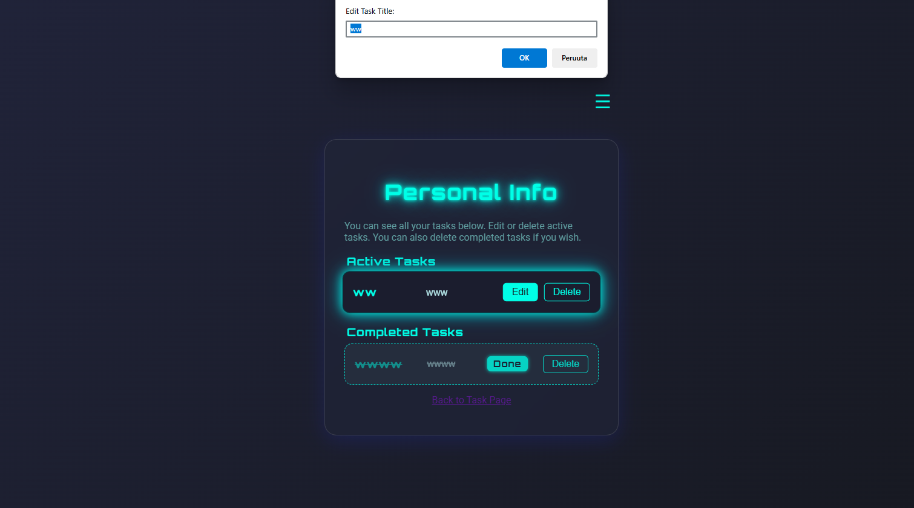

# 📝 To-do-sovellus – Näyttötyö

## 👤 Tekijä

- **Nimi:** Mariel H
- **Koulutus:** Taitotalo / ICT, WEB14
- **Ajankohta:** 26.06.2025

---

## 🔍 Projektin kuvaus

Tämä on to-do-sovellus, jonka avulla käyttäjät voivat:

- Rekisteröityä ja kirjautua sisään
- Lisätä tehtäviä (task)
- Merkitä tehtäviä tehdyiksi
- Muokata tai poistaa tehtäviä
- Tarkastella aktiivisia ja tehtyjä tehtäviä omalla sivullaan

Sovelluksessa on hampurilaisvalikko, joka näyttää käyttäjänimen ja tarjoaa uloskirjautumismahdollisuuden.

---

## 🧭 Palvelun tarkoitus ja käyttäjät

[Tarkoitus Tiivistettynä](kuvat/PalvelunTarkoitus.md)
---

## 🧱 Käytetyt teknologiat

| Osa                | Teknologia                        |
| ------------------ | --------------------------------- |
| Frontend           | EJS / HTML + CSS + JS         |
| Backend            | Node.js + Express                 |
| Autentikointi      | SQL                               |
| Taskien tallennus  | MongoDB                           |
| Versionhallinta    | Git + GitHub                      |
| Kehitysympäristö   | Visual Studio Code                |

---

## ⚙️ CRUD-toiminnot

| Toiminto | Kuvaus                                          |
| -------- | ----------------------------------------------- |
| Create   | Käyttäjä voi lisätä uuden tehtävän              |
| Read     | Tehtävät listataan aktiivisina ja tehtyinä      |
| Update   | Tehtävää voi muokata ja merkitä tehdyksi        |
| Delete   | Tehtävä voidaan poistaa (aktiivinen tai valmis) |

---

## 🧭 Käyttöliittymä

- **Etusivu:** Rekisteröityminen ja kirjautuminen
- **Tehtäväsivu:** Taskin lisääminen ja listaaminen
- **Personal Info -sivu:** Näyttää aktiiviset ja valmiit tehtävät, mahdollisuus muokata ja poistaa
- **Hampurilaismenu:** Käyttäjänimi ja logout

---

## 🔐 Tietoturva

- Käyttäjän tunnistaminen SQL-tietokannan kautta
- Tehtävät näkyvät vain kirjautuneelle käyttäjälle
- MongoDB tallentaa tehtävät käyttäjäkohtaisesti
- Logout-toiminto tyhjentää session/tokenin

---

## 🤝 Työskentely ohjelmistokehitystiimissä

- Sopiminen tehtävistä
- Yhteinen suunnittelu ja toteutuksen aikataulutus
- Yhdessä testaus ja virheiden ratkaisu
- Oman roolin arviointi ja jatkuva kehitys

---

## 🧠 Oppiminen ja arviointi

- Opin yhdistämään SQL ja MongoDB samaan projektiin
- Opin käyttöliittymän ja toiminnallisuuden yhteensovittamista
- Kehitin taitojani versioinnissa ja virheenkorjauksessa
- Ymmärsin paremmin tietoturvan ja käyttäjähallinnan merkityksen

---

## 📸 Kuvakaappauksia

## 🖼️ Kuvia sovelluksesta

### 🔐 Kirjautumissivu


### 🔐 Etusivu


### ➕ Uuden tehtävän lisääminen


### 📋 Personal Info -sivu


### 📋 Hampurilaismenu


```

---

## 🚀 Sovelluksen käynnistäminen

```bash
git clone https://github.com/Markku3/task-manager.git
cd projekti
npm install
npm start
```

---

## 🏁 Yhteenveto

Tämä sovellus on näyttöni ohjelmoinnista ja ohjelmistokehittäjänä toimimisesta. Se kattaa tekniset taidot, käyttäjäkokemuksen sekä CRUD- ja tietoturvanäkökulmat.
