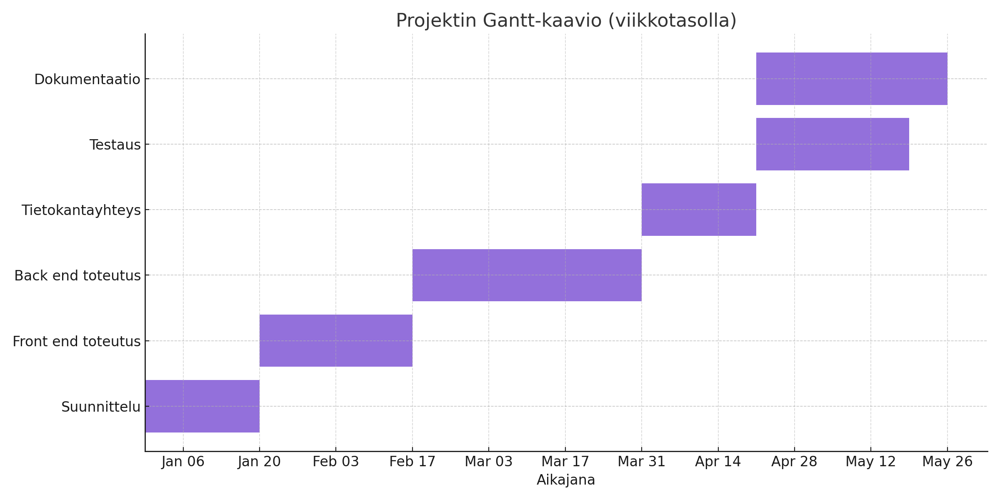
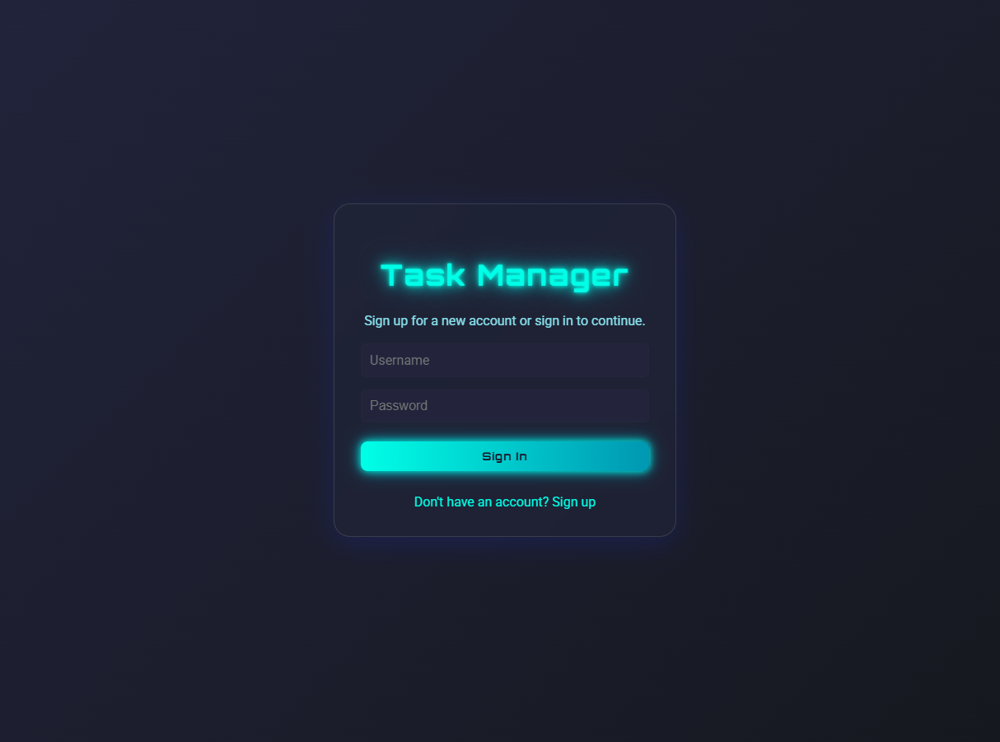
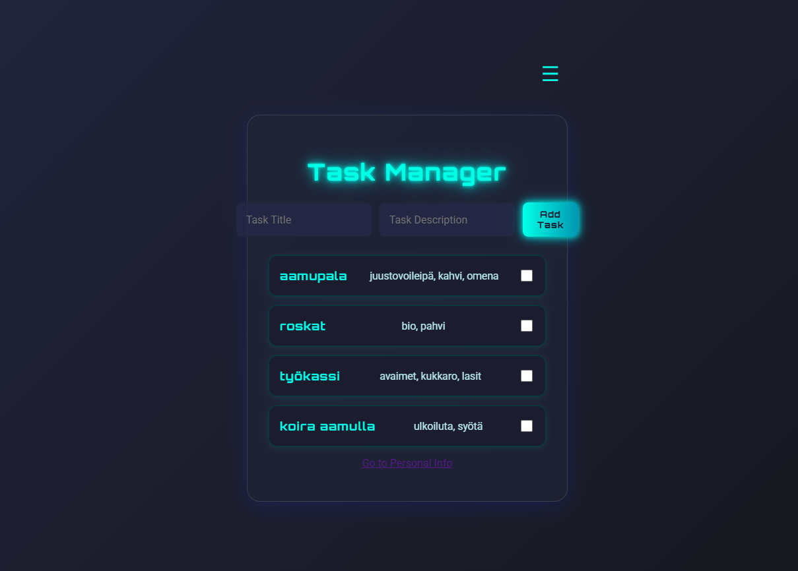
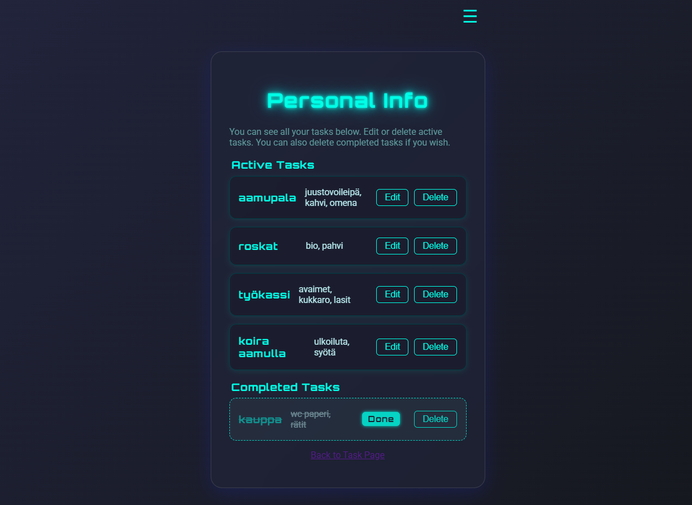
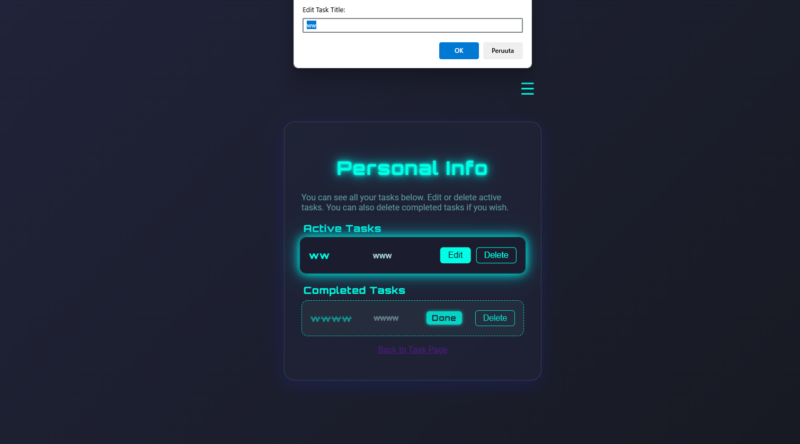
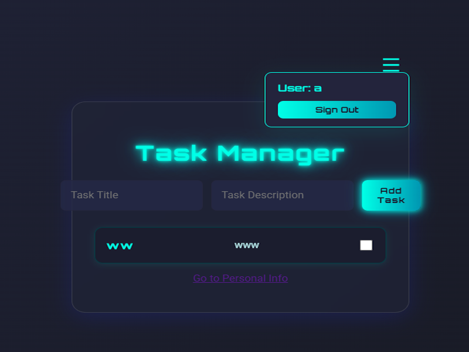

# Task Manager – Tehtävienhallintasovellus

Tämä projekti on yksinkertainen web-pohjainen tehtävienhallintasovellus (todo-task app), jonka avulla käyttäjät voivat hallita ja seurata omia tehtäviään helposti. Sovellus on toteutettu Node.js:llä, Expressillä ja MongoDB:llä, ja se sisältää kaikki perustoiminnot CRUD-periaatteella (luo, lue, muokkaa, poista).

## Ominaisuudet

- Käyttäjätunnukset ja kirjautuminen
- Tehtävien lisääminen, muokkaaminen ja poistaminen
- Tehtävien merkitseminen tehdyiksi
- Käyttäjäkohtaiset tehtävälistat
- Selkeä ja responsiivinen käyttöliittymä

## Käyttöönotto

1. **Kloonaa repositorio:**
   ```bash
   git clone https://github.com/Markku3/task-manager-mongoDB.git
   cd <repo>
   ```

2. **Asenna riippuvuudet:**
   ```bash
   npm install
   ```

3. **Luo .env-tiedosto ja määritä MongoDB-yhteys:**
   ```
   MONGODB_URI=mongodb://localhost:27017/xxxxx
   SESSION_SECRET=xxxxxx
   ```

4. **Käynnistä sovellus:**
   ```bash
   npm start
   ```
   Tai kehitystilassa:
   ```bash
   npm run dev
   ```

5. **Avaa selain ja siirry osoitteeseen:**
   ```
   http://localhost:3000
   ```

## Projektin rakenne

- `server.js` – Sovelluksen backend ja API
- `public/` – Staattiset tiedostot (CSS, JS)
- `views/` – EJS-näkymät
- `db.js` – Tietokantayhteys
- `package.json` – Projektin riippuvuudet ja skriptit

## 🗓 Gantt-kaavio (viikkotasolla)



## 🗓 Ulkonäkö 






