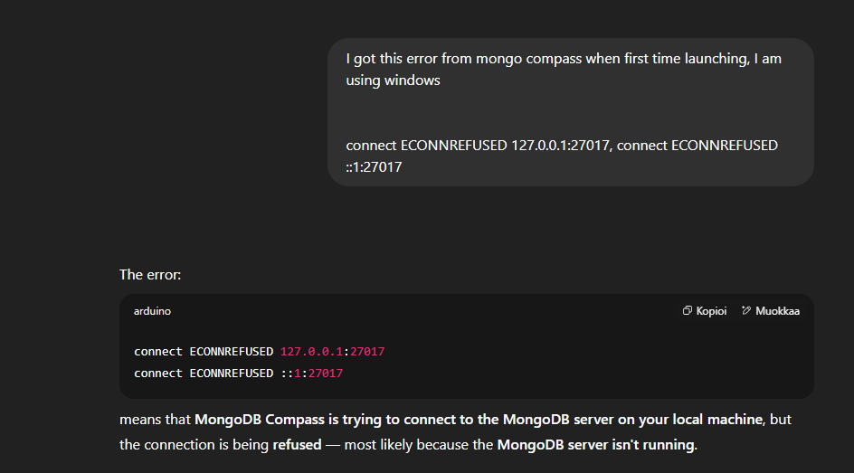
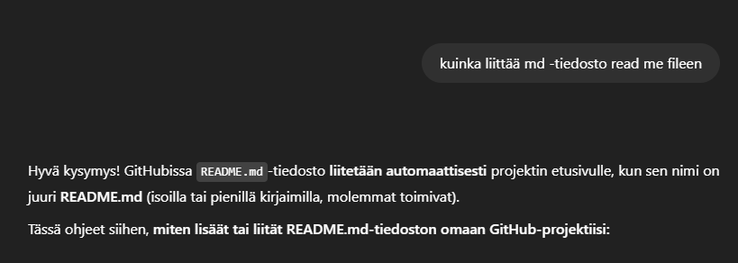

## Tekoälyn käyttö projektissa

Tässä projektissa tekoälyä hyödynnettiin monipuolisesti sisällöntuotannossa ja ideoinnissa:

---

### Tavoitteet

Tavoitteena oli käyttää tekoälyä käännöksissä (terminologiaa), koodien ja kokonaskuvan/skenaarioiden luonnissa. Halusin nopeuttaa työskentelyä ja varmistaa projektin onnistumisen, mutta teknisissä ongelmissa keskityin ensiksi omaan oppimiseen ja opiskeluun ja vasta sen jälkeen tukeuduin tekoälyyn.

---

###  Valinnat ja perustelut

- **Tekstin tuottaminen:** [Copilot](https://copilot.microsoft.com)  – ilmainen, nopea ja tehokas erityisesti selityksissä ja tekstin ideoinnissa.
                        ** [ChatGPT](https://chatgpt.com) – ilmainen, nopea ja tehokas erityisesti selityksissä ja tekstin ideoinnissa.
- **Kontekstin luonti:** [Copilot](https://copilot.microsoft.com) – esim GDPR, input palkit.
                      ** [ChatGPT](https://chatgpt.com) esim GDPR, input palkit.
- **Käännökset:** [Copilot](https://copilot.microsoft.com) – validit käännökset.

---

### 📈 Tulokset ja analyysi

Tekoäly nopeutti työskentelyä ja paransi koodin laatua. Selkeät ja yksinkertaiset ohjeet tuottivat parhaan lopputuloksen. Tekoälyn avulla sain aikaan selkeämmät raamit ja työskentelyprosessin.

---

### 🔍 Reflektio ja oppiminen

Tekoälyn käyttö oli sujuvaa, koska olin jo aiemmin käyttänyt vastaavia työkaluja. Suosittelen muille opiskelijoille mallien toimintaperiaatteisiin perehtymistä ja selkeiden ohjeiden antamista. Mallinhallintaohjelmien käyttö kannattaa opetella, jotta tekoälystä saa parhaan hyödyn. Kuitenkin on hyvä muistaa, että siihen ei kannata nojata täysin, ettei itseoppiminen lopu. Myös tietoturvasyistä työelämässä sen käyttö voi olla rajattua, joten tämän olemassaoloon ei kannata sokeasti uskoa.

## 🗓 Tekoälyn käyttö 

